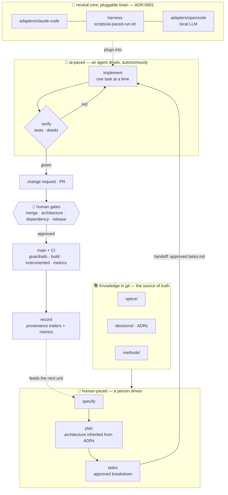

# AI-Native Android Development System

[](https://github.com/rodrigosimoesrosa/ai-native-android-development-system/actions/workflows/ci.yml)
[](LICENSE)
[](docs/00-vision-and-architecture.md)
[](https://github.com/github/spec-kit)

> **This is not "an Android app."** Android is the **proving ground**. The product is a
> **repeatable system for building software with AI agents** — where specifications,
> decisions, and knowledge are as versioned, reviewable, and executable as the code itself.

The bet: the differentiator in software is shifting from *who writes code* to *who maintains a
legible, verifiable system of intent* that both people and models can act on safely. This repo is a
concrete, opinionated demonstration — a **reference implementation for AI-assisted development**,
proven on a real Android codebase with enough complexity (Gradle, multi-module, Compose, coroutines,
auth/refresh) that the method can't hide behind a toy.

📖 Start with the [Vision & Architecture](docs/00-vision-and-architecture.md) and the
[Constitution](.specify/memory/constitution.md). The [Knowledge Map](index.md) links everything.

---

## The idea in one loop

Every unit of work travels the **same documented path** — driven by [GitHub Spec Kit](https://github.com/github/spec-kit)
(ADR-0002), verified by tests, closed by recording a decision:

```
spec  →  plan  →  tasks  →  implement  →  verify  →  record
 │        │        │           │            │          │
 │        │        │           │            │          └─ ADR when a decision was made
 │        │        │           │            └─ tests green in CI = "done" (Principle III)
 │        │        │           └─ code, small diffs, module boundaries enforced by the compiler
 │        │        └─ dependency-ordered, LLM-executable checklist
 │        └─ architecture is INHERITED from ADRs here, never rediscovered
 └─ machine-readable intent + acceptance criteria (the entry point for any agent)
```

**Two things make this survive:**

- **Specs are the source of truth.** Code implements a spec; tests verify it. If they disagree, one is a bug.
- **Neutral core, pluggable adapters** (ADR-0001). The project's intelligence lives in tool-agnostic
  files in git (`specs/`, `decisions/`, `docs/`, the app, tests). AI tooling (Spec Kit, Claude Code
  skills/hooks) is a thin, replaceable layer on top. Swapping the AI tool means rewriting an adapter,
  never the project.

---

## Architecture

Two architectures coexist and are kept distinct.



*The **process** (top) is the product; the Android app is where it is proven. Humans drive
`specify → plan → tasks` and hold every merge/architecture/dependency/release **gate**; an agent
autonomously drives `implement → verify` over an already-approved task list. The **brain is
swappable** (Claude Code or a local LLM via opencode) without touching the project — spec 004 was
shipped end-to-end by the opencode adapter.*

### 1. Engineering process (the actual product)

The knowledge layer in git (`specs/`, `decisions/`, `docs/`) feeds an **agent workflow** (the loop
above) gated by **mandatory human checkpoints** — merge, architecture change, dependency add, release
— and backed by a **verification layer** (tests, CI, the Stop-hook loop below).

### 2. Android app (the proving ground)

Deliberately conventional — **pragmatic Clean Architecture + MVI** (ADR-0003). Gradle modules make
the dependency rule compiler-enforced; the domain is pure Kotlin/JVM.

| Module | Type | Depends on | Holds |
|---|---|---|---|
| `:core` | pure JVM | — | `Result`/`FlowResult`/`AppError`, dispatcher qualifiers |
| `:core-ui` | Android lib | — | Generic MVI base (`MVIViewModel`, `Reducer`, `UiState/Event/Effect/Intent`) |
| `:domain` | pure JVM | `:core` | Entities, **repository interfaces**, use cases — no Android/framework |
| `:data` | Android lib | `:domain`, `:core` | Repository **impls**, Retrofit/Room/DataStore, mappers, DI binds |
| `:feature:<x>` | Android lib | `:domain`, `:core`, `:core-ui` | MVI ViewModels + Compose UI |
| `:app` | Android app | all | Composition root — Hilt wiring, `NavHost` |

**The dependency rule (DIP):** `:data → :domain → :core`. The domain defines the abstractions
(repository interfaces); `:data` implements them, so arrows point inward. A feature never sees a data
model. See ADR-0003/0004/0005/0006 for the binding decisions.

---

## Repository layout

```
methods/             # the neutral, tool-agnostic "how" of each capability (ADR-0008)
adapters/            # thin tool layer that invokes methods (claude-code + opencode both active)
.specify/            # Spec Kit engine: templates, scripts, constitution (part of the tool adapter)
decisions/           # ADRs — every non-trivial decision, cross-linked
docs/                # Vision & architecture (the "why")
specs/<NNN-name>/    # One folder per feature: spec, plan, research, data-model, contracts, tasks
scripts/             # gradle-verify.sh + guardrail checks (verification loop)
.github/workflows/   # CI (the "green = done" merge gate)
core/ core-ui/ domain/ data/ feature/<x>/ app/   # the Android proving ground
```

---

## Build & run

**Prerequisites:** JDK 17+, Android SDK (`compileSdk 36`), an emulator/device on **API 26+**.

```bash
./gradlew test                 # all JVM unit tests (:core, :domain, and *DebugUnitTest per module)
./gradlew :app:assembleDebug   # build the APK (proves the full Hilt graph resolves)
./gradlew :app:installDebug    # install on a running emulator/device
```

The app opens on **SendPhone** and is backed by a `FakeAuthApi` (no real backend, ADR-0006 §6).
Sign in with any valid international phone (e.g. `+15551234567`) and the fake code **`123456`** to
reach the authenticated **navigation shell** (spec 003): a bottom bar switching between **Home** and
**Profile** (spec 002) — view your details, edit your display name, and set theme + notification
preferences, each tab keeping its own state.

---

## How to create a new feature

Features exist **only to exercise the system** — they must be representative and non-trivial, never a
showcase. Every feature follows the same loop. Architecture is **inherited from the ADRs at plan
time**, so you never re-decide Clean Architecture, DI, persistence, or networking per feature.

### Step 0 — Branch (recommended)

Small diffs + a real merge gate are the concurrency primitive (Constitution). Work on a branch and
open a PR so CI runs and a human approves the merge.

### Step 1 — `/speckit-specify` → the spec

```
/speckit-specify Users can <do X>: <short natural-language description of the behavior>
```

Creates `specs/<NNN-feature>/spec.md` (and the `NNN-feature` branch) with **user stories (prioritized
P1/P2/P3), acceptance scenarios, functional requirements (FR-###), success criteria (SC-###), edge
cases**. No implementation detail — behavior only.

- *(optional)* `/speckit-clarify` — asks up to 5 targeted questions and folds answers back into the spec.

### Step 2 — `/speckit-plan` → the design

```
/speckit-plan
```

Generates `plan.md`, `research.md`, `data-model.md`, `contracts/`, `quickstart.md`. It fills the
Technical Context, runs the **Constitution Check gate**, and pulls the architecture from the ADRs.
Resolve any `NEEDS CLARIFICATION` here. New cross-cutting decisions become a new **ADR** in `decisions/`.

### Step 3 — `/speckit-tasks` → the work list

```
/speckit-tasks
```

Generates `tasks.md`: a dependency-ordered, LLM-executable checklist grouped **by user story**
(`Setup → Foundational → US1 → US2 → … → Polish`), each task with an ID, `[P]` parallel marker, and
exact file path. Tests are **tests-first** (Constitution Principle III is non-negotiable).

- *(optional)* `/speckit-analyze` — read-only cross-artifact consistency check (spec ↔ plan ↔ tasks); fix gaps before building.
- *(optional)* `/speckit-checklist` — a custom quality checklist for the feature.

### Step 4 — `/speckit-implement` → build it

```
/speckit-implement                       # everything
/speckit-implement stop after User Story 1   # scope to the MVP slice
```

Executes the tasks phase by phase, respecting dependencies and TDD order, marking each `[x]` in
`tasks.md`. Build **bottom-up through the modules**: `:domain` (use cases + tests) → `:data` (repo
impls + MockWebServer tests) → `:feature:<x>` (ViewModels + Compose + tests), verifying each module
with Gradle before moving on. Prefer scoping to one user story at a time so each is an independently
demonstrable increment.

### Step 5 — Verify (automatic)

The verification loop closes **Principle III** on two sides:

- **Local (in-session):** a `Stop` hook (`.claude/settings.json` → `scripts/gradle-verify.sh`) runs
  the fast JVM tests whenever Kotlin/Gradle sources changed and feeds failures back to the agent to
  keep fixing. Skips when nothing relevant changed.
- **CI (merge gate):** `.github/workflows/ci.yml` runs the full gate on every push/PR — guardrails ·
  build (`./gradlew test` + detekt) · instrumented (emulator) · metrics. Green is the definition of "done".

### Step 6 — Record & merge (human gate)

- Record provenance and any decision (an **ADR**) — "why does this exist?" always has a linkable answer.
- Open the PR; a human approves at the **merge gate**. Dependency additions and architecture changes
  are their own gates.

> A `/speckit-converge` command exists to reconcile an existing codebase against a spec/plan/tasks and
> append remaining work — useful when picking up partially built features.

### Worked example

`specs/001-otp-auth/` is the first feature end-to-end: OTP phone auth with session continuity. It
exercises the full read path (`GET /me`), write path (verify → persist encrypted session), and the
transparent-refresh infrastructure — read it as the canonical template for a new feature.

---

## Run modes — human-paced & ai-paced

The same loop runs two ways, sharing one neutral core (ADR-0009). A run mode is an **orchestration
axis, not a fork** — only the **driver** and the **gate policy** ([`run-modes.yml`](run-modes.yml))
differ.

| | human-paced (default) | ai-paced |
|---|---|---|
| Driver | a person, turn by turn | an agent, autonomously |
| Trigger | interactive session | an open spec (headless) |
| Human gates | every checkpoint | **only** merge · architecture · dependency · release |

**ai-paced is not "no humans":** it is autonomous only over small, verifiable units inside an
already-approved spec, passes the **same** verification gate (tests + detekt + guardrails), and
**escalates** the four mandatory gates. See [`methods/run-modes.md`](methods/run-modes.md). The
ai-paced loop runs on a **tool-neutral harness** ([`scripts/ai-paced-run.sh`](scripts/ai-paced-run.sh))
with a **pluggable brain**: [`adapters/claude-code/`](adapters/claude-code/README.md) (Claude Code) or
[`adapters/opencode/`](adapters/opencode/README.md) (a **local** Ollama / LM Studio model). Swap the
brain by choosing the launcher — the harness, gate, escalation, and provenance are unchanged.

---

## Tech stack (pinned in `gradle/libs.versions.toml`)

Boring, mainstream, deterministic — the novelty budget is spent on the *process*, not the stack.

| Concern | Choice | ADR |
|---|---|---|
| Language / build | Kotlin `2.2.20`, AGP `8.13.0`, Gradle `8.13`, KSP | — |
| Architecture | Clean Architecture + MVI, pure domain, typed `Result`/`AppError` | [0003](decisions/ADR-0003-android-architecture-clean-mvi.md) |
| DI | Hilt/Dagger `2.56.2` (`:app` = composition root) | [0004](decisions/ADR-0004-dependency-injection-hilt.md) |
| Persistence | Room `2.8.4` (relational) + Proto DataStore `1.2.1` (typed state, Keystore-encrypted) | [0005](decisions/ADR-0005-local-persistence-room-datastore.md) |
| Networking | Retrofit `3.0.0` + OkHttp `5.4.0` + kotlinx.serialization; JWT auth + single-flight refresh | [0006](decisions/ADR-0006-networking-and-auth-token-strategy.md) |
| Tests | JUnit, kotlinx-coroutines-test, Turbine, MockK, MockWebServer | — |

> **Note (ADR-0004 Amendment 1):** Hilt is pinned to `2.56.2` (not `2.60.1`) because Hilt ≥ 2.58
> requires AGP 9.0, which removes the `kotlin.android` plugin. The AGP-8 baseline is deliberate;
> AGP-9 migration is deferred. The build is verified green on this combination.

---

## Current status (honest by design)

| Area | State |
|---|---|
| Knowledge layer (vision, constitution, 10 ADRs) | ✅ in git, cross-linked |
| Module skeleton + `:core`/`:core-ui` contracts | ✅ built & tested |
| `001-otp-auth` — US1 sign-in → Home, US2 transparent refresh, US3 teardown | ✅ implemented & verified (63/63 tasks, tests green) |
| `002-user-profile` — view details, edit name, theme + notification prefs | ✅ implemented & verified (26/26 tasks) |
| `003-navigation` — authenticated bottom-bar shell, per-tab state | ✅ implemented & verified (13/13 tasks) |
| `004-confirm-sign-out` — confirm dialog, **ai-paced by the opencode adapter** (local LLM) | ✅ implemented & verified (12/12 tasks) |
| Verification loop (local Stop-hook + CI: guardrails · build · instrumented · metrics) | ✅ active |
| Provenance trailers + process metrics (ADR-0010) | ✅ live (`scripts/metrics.sh`, CI `metrics` job) |
| Second adapter (opencode / local Ollama · LM Studio) | ✅ real — shipped spec 004 end-to-end |
| `methods/` + `adapters/` extraction to a stand-alone, cold-start-tested harness | ⬜ aspirational (v2 roadmap, ADR-0001) |

This mirrors the vision's honesty stance (§8): the README says what is real, what is aspirational, and
that both humans and agents authored this. See the [roadmap](docs/00-vision-and-architecture.md#10-roadmap)
(v1 → v2 → v3).

---

## By the numbers (evidence, not claims)

The process is auditable because provenance is in git: every stamped commit carries `Provenance-Spec`,
`Provenance-Method`, `Provenance-Agent`, and `Provenance-Model` trailers (ADR-0010). Regenerate any of
this yourself with [`scripts/metrics.sh`](scripts/metrics.sh):

| Metric | Value |
|---|---|
| Features shipped through the full loop (spec → plan → tasks → implement → verify → record) | **4** (`001`–`004`) |
| Tasks executed, all closed | **114** (63 + 26 + 13 + 12) |
| Unit tests | **green** (`./gradlew test`, CI-gated on every push/PR) |
| Commits with machine-readable provenance | traceable to spec + agent + method |
| Work driven **ai-paced** (autonomous over approved tasks) | **22%** of stamped commits |
| Autonomous work by a **local** model | spec `004`, executed by `qwen 35B` via LM Studio — **zero cloud calls** |
| Human gates never crossed autonomously | merge · architecture · dependency-add · release |

The headline isn't "AI wrote the code." It's that a **local** model shipped a real feature end-to-end
inside guardrails it could not bypass — the same tests, detekt, and merge gate a human faces — and left
a provenance trail proving exactly what it did. That is the case for **AI as architecture**: the system,
not the model, is the differentiator.

---

## Where to read next

- **[Live case study](https://rodrigosimoesrosa.github.io/ai-native-android-development-system/)** — the architecture at a glance (GitHub Pages).
- [Constitution](.specify/memory/constitution.md) — the rules humans and agents build by.
- [Vision & Architecture](docs/00-vision-and-architecture.md) — what this is and why.
- [ADRs](decisions/) — every decision, with rationale and alternatives.
- [`specs/001-otp-auth/`](specs/001-otp-auth/) — a complete worked feature (spec → plan → tasks).
- [`specs/004-confirm-sign-out/`](specs/004-confirm-sign-out/) — the same loop driven **ai-paced by a local LLM** (opencode).
- [index.md](index.md) — the knowledge map (renders as a graph in Obsidian / GitHub).

---

## License & author

MIT © 2026 Rodrigo Simões Rosa — see [LICENSE](LICENSE). Fork it, run the loop, swap the adapter.

This repository is the reference implementation behind an article on **using AI as architecture in an
Android project**. Both humans and models authored it, and the provenance trailers say which did what.
