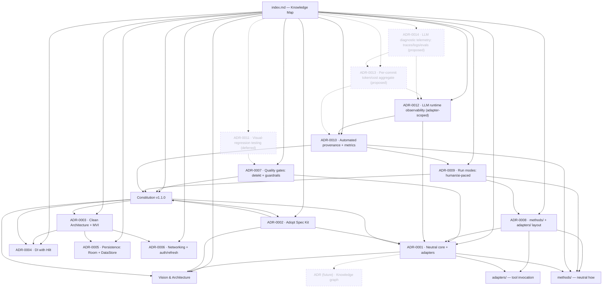

# Knowledge Map

Hub note for the project's knowledge graph. The graph is rendered two ways, both from
plain-text markdown in git — no tool lock-in (see [ADR-0001](decisions/ADR-0001-build-on-existing-tools-neutral-core.md)):

- **Mermaid diagram below** — renders inside Android Studio / IntelliJ markdown preview,
  on GitHub, and in Obsidian. No external app needed.
- **Interactive graph** — open this folder as an Obsidian vault (`Open folder as vault`) for
  the force-directed view built from the markdown links.

## Graph

## Foundation

- [Vision & Architecture](docs/00-vision-and-architecture.md) — what this project is and why.
- [Constitution](docs/constitution.md) — the rules humans and agents build by (v1.1.0).
- [AI Architecture — Responsibilities Map](docs/ai-architecture-map.html) — visual map: neutral core ↔ adapter boundary, the SDD loop, where run metrics come from, and how `decisions/` (ADRs) are used.

## Decisions (ADRs)

- [ADR-0001 — Neutral core, tools as pluggable adapters](decisions/ADR-0001-build-on-existing-tools-neutral-core.md)
- [ADR-0002 — Adopt GitHub Spec Kit as the SDD engine](decisions/ADR-0002-adopt-spec-kit-as-sdd-engine.md)
- [ADR-0003 — Android architecture: Clean Architecture + MVI](decisions/ADR-0003-android-architecture-clean-mvi.md)
- [ADR-0004 — Dependency Injection with Hilt](decisions/ADR-0004-dependency-injection-hilt.md)
- [ADR-0005 — Local persistence: Room + Proto DataStore](decisions/ADR-0005-local-persistence-room-datastore.md)
- [ADR-0006 — Networking + JWT auth/refresh strategy](decisions/ADR-0006-networking-and-auth-token-strategy.md)
- [ADR-0007 — Quality gates: detekt + method guardrails](decisions/ADR-0007-quality-gates-detekt-and-method-guardrails.md)
- [ADR-0008 — Materialize the methods/ + adapters/ layout](decisions/ADR-0008-methods-and-adapters-layout.md)
- [ADR-0009 — Run modes: human-paced / ai-paced](decisions/ADR-0009-run-modes-human-paced-and-ai-paced.md)
- [ADR-0010 — Automated provenance (commit trailers) + metrics](decisions/ADR-0010-automated-provenance-and-metrics.md)
- [ADR-0011 — Visual-regression (snapshot) testing](decisions/ADR-0011-visual-regression-testing-deferred.md) — **Deferred** (revisit when ai-paced authors non-trivial Compose UI)
- [ADR-0012 — LLM runtime observability](decisions/ADR-0012-llm-runtime-observability-adapter-scoped.md) — **adapter-scoped** (token/cost/latency/traces live in adapters, never the neutral core; only git-native aggregates cross back)
- [ADR-0013 — Per-commit token/cost aggregate](decisions/ADR-0013-per-commit-token-cost-aggregate.md) — **Proposed** (`Provenance-Tokens`/`Provenance-Cost` commit trailers; per-commit not per-file; local ⇒ `Cost: 0USD`, `-` = not measured)
- [ADR-0014 — LLM diagnostic telemetry (traces/logs/evals)](decisions/ADR-0014-llm-diagnostic-telemetry-traces-logs-evals.md) — **Proposed** (adapter-scoped diagnosis pillars; only content-free aggregates cross to git; prompt/response logging opt-in, never in core). Completes the observability design (0010 process + 0013 cost + 0014 diagnosis)

## Specs

One folder per feature (`specs/<NNN-name>/`): spec, plan, research, data-model, contracts, tasks.
Transient work units that travel the loop; the durable decisions they inherit live in the ADRs above.

- [001 — OTP Auth](specs/001-otp-auth/spec.md)
- [002 — User Profile](specs/002-user-profile/spec.md)
- [003 — App Navigation Shell](specs/003-navigation/spec.md)
- [004 — Confirm Sign-Out](specs/004-confirm-sign-out/spec.md) — implemented **ai-paced by opencode** (local LLM)

## Method layer (neutral core vs. adapters)

The portability guarantee of ADR-0001, made concrete (ADR-0008):

- [`methods/`](methods/README.md) — the tool-agnostic "how" of each capability.
- [`adapters/`](adapters/README.md) — the thin, disposable tool layer: [claude-code](adapters/claude-code/README.md) and [opencode](adapters/opencode/README.md) (a **local** LLM) are **both active** — opencode drove spec `004` end-to-end.

## Not created yet (dangling nodes — intentional)

These appear grey in the graph until written:

- ADR (future) — Knowledge-graph representation
