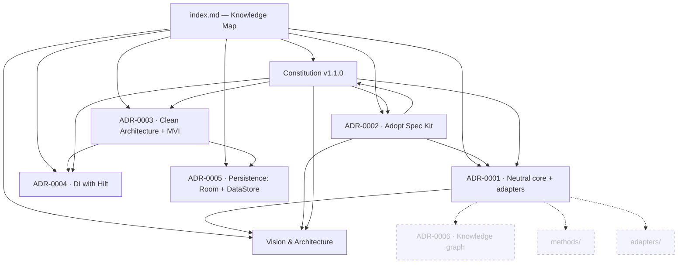

# Knowledge Map

Hub note for the project's knowledge graph. The graph is rendered two ways, both from
plain-text markdown in git — no tool lock-in (see [ADR-0001](decisions/ADR-0001-build-on-existing-tools-neutral-core.md)):

- **Mermaid diagram below** — renders inside Android Studio / IntelliJ markdown preview,
  on GitHub, and in Obsidian. No external app needed.
- **Interactive graph** — open this folder as an Obsidian vault (`Open folder as vault`) for
  the force-directed view built from the markdown links.

## Graph

## Foundation

- [Vision & Architecture](docs/00-vision-and-architecture.md) — what this project is and why.
- [Constitution](docs/constitution.md) — the rules humans and agents build by (v1.0.0).

## Decisions (ADRs)

- [ADR-0001 — Neutral core, tools as pluggable adapters](decisions/ADR-0001-build-on-existing-tools-neutral-core.md)
- [ADR-0002 — Adopt GitHub Spec Kit as the SDD engine](decisions/ADR-0002-adopt-spec-kit-as-sdd-engine.md)
- [ADR-0003 — Android architecture: Clean Architecture + MVI](decisions/ADR-0003-android-architecture-clean-mvi.md)
- [ADR-0004 — Dependency Injection with Hilt](decisions/ADR-0004-dependency-injection-hilt.md)
- [ADR-0005 — Local persistence: Room + Proto DataStore](decisions/ADR-0005-local-persistence-room-datastore.md)

## Not created yet (dangling nodes — intentional)

These appear grey in the graph until written:

- ADR-0006 — Knowledge-graph representation
- `methods/` — the neutral "how" behind each skill
- `adapters/` — tool-specific invocation layer
